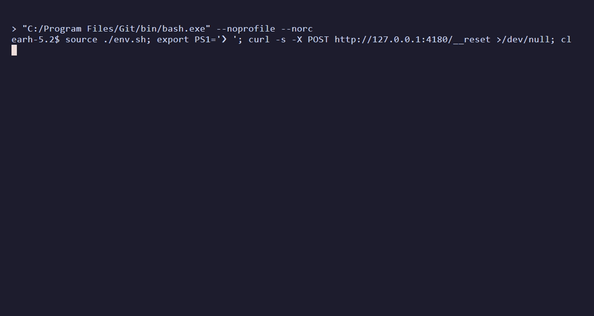

# sitelooper

**Write browser tests in plain English. Run them in CI as plain Playwright. Repair them automatically when the app changes.**

sitelooper is a CLI with a small LLM agent inside. You give it one instruction at a time, such as
"sign in as ops@example.com, create a ticket titled 'k7 Bench' and report its id". It works the
live browser and returns one verified result. Every step it gets right is compiled into a
procedure that replays with **no model, no tokens and no cost**, and can be exported as a
standalone `@playwright/test` spec.



*Recorded once against the in-repo repair-desk app (24s, 28s and 42s with the agent driving).
The app is reset, the same flow replays in 16s with zero model calls, and then the app's own
state is queried.*

## How it works

1. **Record.** A cheap model follows your instructions. As it works, sitelooper records durable
   locators, where each value came from, and what each step changed on the page.
2. **Replay.** The recording replays deterministically. If the app has changed under a step, only
   that step goes back to the model, and a recovery that validates is pinned into the flow, so
   the flow heals itself over runs.
3. **Compile.** `sitelooper build` emits a Playwright spec with effect checks on every step. It
   runs in CI with no sitelooper daemon and no model.

## Results

Each run was scored against the app's own database or API, never against the tool's own
report. These are four of the ten benchmarked apps, compared with an agent (agent-browser) that
redoes the job on every run:

| app | agent, every run | sitelooper, first run | sitelooper replay | compiled spec |
|---|---|---|---|---|
| repair-desk | 6/6 · $0.19 · 67s | 6/6 · $0.08 · 396s | **6/6 · $0 · 31s** | 6/6 · 35s |
| Kanboard | 2/6 (turn cap) · $0.77 · 118s | 6/6 · $0.07 · 320s | **6/6 · $0 · 28s** | 4/4 + 2 report-only · 25s |
| Grafana | 6/6 · $1.05 · 448s | 6/6 · $0.10 · 801s | **6/6 · $0 · 76s** | 4/4 + 2 report-only · 77s |
| Odoo | 6/6 · $1.51 · 302s | 6/6 · $0.11 · 482s | **6/6 · $0 · 62s** | 6/6 · 55s |

When the same agent wrote its own Playwright script from its run, the scripts verified
**14 of 48** objectives across these four apps. On Odoo, one script confirmed a sales order with
no lines and only then reported failure. sitelooper's compiled specs verified **20 of 20**
checkable objectives.

- [bench/RESULTS.md](bench/RESULTS.md): all ten apps, the protocol, and what the benchmark does
  not show
- [bench/RESULTS-HISTORY.md](bench/RESULTS-HISTORY.md): the full matrices from rounds 24–32
- [bench/SWEEPS.md](bench/SWEEPS.md): one row per sweep, with the cause of every miss

## Quick start

You need Node 20+ and an [OpenRouter](https://openrouter.ai) API key for authoring. The compiled
tests need only `@playwright/test`.

```sh
npm install -g sitelooper
npm install -D @playwright/test && npx playwright install chromium
export OPENROUTER_API_KEY=sk-or-...
sitelooper doctor        # shows the provider and models it will use, and why
sitelooper init          # writes sitelooper.config.json
```

Record one logical outcome per instruction. Use `{{env:NAME}}` for credentials, and declare
values that should change between runs with `var`. Here, `demo` becomes a `{{runid}}` slot:

```sh
sitelooper --session ticket --learn open http://localhost:3000
sitelooper --session ticket var runid=demo
sitelooper --session ticket do "Sign in as {{env:TEST_USER}} using {{env:TEST_PASSWORD}} and verify the dashboard opens"
sitelooper --session ticket do "Create a ticket titled 'demo Test'; verify it appears and report its id"
sitelooper --session ticket stop --save-flow ticket
sitelooper flow export ticket --out .sitelooper/procedures.json
```

Build the test and run it:

```sh
sitelooper build ticket --var runid=test-{n} --reset-cmd "npm run reset:e2e"
# or, if your Playwright fixtures already prepare fresh data:
# sitelooper build ticket --var runid=test-{n} --fixture-isolation
npx playwright test tests/sitelooper/ticket.spec.ts
```

`ticket.flow.ts` is generated: it holds the procedures, a typed input/output API, named steps and
effect checks. `ticket.spec.ts` belongs to you. Add business assertions and fixtures there, and
recompiling will never overwrite it.

## Why an agent's own script doesn't rerun

Asking the agent to write a script from what it did fails for structural reasons:

- **The run's values are baked in.** The script quotes today's record id, so tomorrow it opens
  yesterday's record, or works the wrong one to completion and reports success.
- **The selectors name positions, not things.** `tr:nth-of-type(3)`, generated class names, a
  textbox named after the current minute.
- **The waits are gone.** Each of the agent's observation turns was a pause the app needed.
- **Nobody checks the effect.** A click can "succeed" on the wrong element, and a save can be
  refused by a dialog the script never saw.

sitelooper treats the recording as evidence to compile, not text to replay:

- **Locator chains**, including role and name, label, test id and a structural path. Candidates
  are retired by measuring which ones resolve on each replay.
- **Parameters, not literals.** Typed values become slots, and declared values become
  `{{runid}}`. A value that one step read and a later step used is threaded between them live. An
  id the app minted is re-read on each run, and anything with no source is left for recovery
  instead of being guessed.
- **Effect gates.** A step that ran but did not produce its recorded effect stops the replay
  before the next step acts on the wrong state.
- **A recovery ladder.** Each step first replays with zero model calls. If that fails, a cheap
  model recovers it; if that is blocked, a stronger model tries; if that fails too, the run halts
  and reports per-step state.
- **Nothing app-specific in the tool.** App knowledge goes in an optional per-session briefing,
  so a fix for one app never becomes a hack for it.

## Using it in a project

### Readiness means running the emitted code

`build <flow-or-bundle>` compiles the flow and runs the readiness gate. `check <name.flow.ts>
--ready` runs the same gate on an existing artifact. Plain `compile` works offline, and plain
`check` runs the spec once.

The gate requires three clean executions with retries disabled. Each run starts from state
prepared by the reset command or by declared fixtures, and it uses at least two distinct datasets
(`{n}` becomes `1`, `2`, `3`). No step may be skipped, unresolved or drifted. The gate uses your
Playwright config and project (`--config`, `--project`). Evidence goes to
`<name>.readiness.json`, or to `--report <file.json>`. Three clean runs are an execution gate, not
a statistical guarantee against flakiness.

`--negative-spec <file>` adds an authored fault-injection test that must fail its outcome
assertion, and it reports `failureDetection: verified`. See
[project fixtures and negative checks](docs/testing-workflow.md).

### Project configuration

`sitelooper init` creates `sitelooper.config.json`. The nearest ancestor config supplies
defaults, and CLI flags override them. Never put credentials in this file.

```json
{
  "targetUrl": "http://localhost:3000",
  "vars": { "runid": "test-{n}" },
  "requiredVars": ["runid"],
  "resetCommand": "npm run reset:e2e",
  "playwright": { "config": "playwright.config.ts", "project": "chromium" },
  "verificationRuns": 3,
  "outputDir": "tests/sitelooper",
  "snapshotFile": ".sitelooper/procedures.json"
}
```

`targetUrl` may be relative to Playwright's `baseURL`. `fixtureIsolation: true` replaces the
reset command. `flow export` bundles a flow with its pinned procedures so that another machine can
compile it. Commit the bundle, the config and the generated files.

### One-time codes

Put a test account's TOTP seed (base32, or the whole `otpauth://` URI) in an environment variable
and write `{{totp:NAME}}` where the code goes. The code is generated when it is typed. Recordings
and compiled specs keep only the marker, never the seed or a code.

```sh
export TEST_TOTP=JBSWY3DPEHPK3PXP   # a test user's seed, never a real person's
sitelooper --session ticket do "Enter the authentication code {{totp:TEST_TOTP}} and verify the dashboard opens"
```

### Repair once, review, apply

```sh
sitelooper repair tests/sitelooper/ticket.flow.ts --propose ticket-repair.json \
  --var runid=repair-{n} --reset-cmd "npm run reset:e2e"
sitelooper repair apply ticket-repair.json
```

A proposal does a live triage run and convergence runs, and then checks a staged candidate under
plain Playwright next to your original spec. Review it before you apply it. `apply` writes exactly
the source that was checked, and it refuses if anything has changed since then. Your `.spec.ts` is
never rewritten. When a diagnostic points at a bad recording, run `rerecord <flow> <step>` to
re-record just that step in isolation.

Override flags are kept separate: `--allow-demoted` accepts a diagnosed demoted procedure, and
`--overwrite-spec` replaces the user scaffold.

### Calling from another agent

`--json` returns versioned results (`schemaVersion`, `stage`, `outcome`, `nextActions` as
argument arrays). `--report <file.json>` writes the same document to a fixed path. Progress goes
to stderr. For multiline instructions, use `do --instruction-file <file>` or `do --stdin`.

`do` returns `{report: {status, summary, details?, evidence?}, turns, usage, model}`. On a turn or
time cap it also returns `actions`, the tool calls that ran, so a caller can check state before
resuming. Snapshots, retries and tool chatter stay inside the daemon.

Exit codes: `0` success, `1` agent/recording failure, `2` invalid input, `3` replay convergence
failure, `4` compiled-spec/readiness failure.

A Claude Code skill ships in `skills/sitelooper/SKILL.md`. Copy it to
`~/.claude/skills/sitelooper/`.

## Reference

### Providers

The LLM layer is an OpenAI-compatible adapter with presets.

| Preset | Base URL | Default model | Escalation model | Key env var |
|---|---|---|---|---|
| `openrouter` (default) | `https://openrouter.ai/api/v1` | `deepseek/deepseek-v4.1-flash` (DeepSeek backend) | `z-ai/glm-5.3` | `OPENROUTER_API_KEY` |
| `zhipu` | `https://api.z.ai/api/paas/v4` | `glm-5.2` | — | `GLM_API_KEY` / `ZHIPU_API_KEY` |
| `novita` | `https://api.novita.ai/openai` | `deepseek/deepseek-v4-flash` | `zai-org/glm-5.3` | `NOVITA_API_KEY` |
| `openai` | `https://api.openai.com/v1` | `gpt-5-mini` | — | `OPENAI_API_KEY` |
| `anthropic` | `https://api.anthropic.com` (native Messages API) | `claude-sonnet-5` | — | `ANTHROPIC_API_KEY` |

Every field resolves in the order **flag > env > config file > preset**: `--provider`,
`--model`, `--base-url`, `--fallback-model`; `SITELOOPER_PROVIDER`, `SITELOOPER_MODEL`,
`SITELOOPER_FALLBACK_MODEL`, `SITELOOPER_BASE_URL`, `SITELOOPER_API_KEY`; and
`sitelooper config set <key> <value>`, which writes `~/.sitelooper/config.json`. Prefer env for
the key.

- **No provider named.** A Z.ai key keeps `zhipu`. Otherwise `OPENROUTER_API_KEY` selects
  `openrouter`, a generic `SITELOOPER_API_KEY` goes to `zhipu`, and with no key at all the
  default is `openrouter`. `sitelooper doctor` prints the choice and the reason.
- **Routing pin.** With its default model, the `openrouter` preset sends
  `{"provider":{"only":["DeepSeek"]}}`, which is the backend the benchmark prices assume.
  `SITELOOPER_EXTRA_BODY` replaces it, and `'{}'` turns it off. `SITELOOPER_FALLBACK_EXTRA_BODY`
  sets the same for the escalation model.
- **Escalation.** An instruction reported `blocked` is retried once on the escalation model, in
  the same browser, which is told to re-check state before it repeats anything. A verified
  `failure` is not retried. `--no-escalate` turns this off.

### Configuration

| Env / flag | Default | |
|---|---|---|
| `SITELOOPER_CHANNEL` | `chrome` → `msedge` → bundled | browser channel |
| `SITELOOPER_EXECUTABLE` | — | explicit browser binary |
| `SITELOOPER_HEADED=1`, `--headed` | headless | visible window (first call of a session) |
| `SITELOOPER_HOME` | `~/.sitelooper` | sessions, skills, flows, config |
| `SITELOOPER_SKILLS=1`, `--learn` | off | learning mode; `SITELOOPER_SKILLS_DIR` relocates the store |
| `SITELOOPER_FLOWS_DIR` | `~/.sitelooper/flows` | flow files |
| `SITELOOPER_RECORD=1`, `--record` | off | webm per tab; paths printed by `stop` |
| `SITELOOPER_SCRIPT=1`, `--script` | off | record every action as a raw Playwright step (exploratory) |
| `--max-turns` | 30 | agent turn cap per instruction |
| `--timeout` | 300 | wall-clock seconds per instruction |
| `--turn-timeout` | 90 | seconds for one LLM call before it is aborted and nudged |

Run `sitelooper --help` for the full command reference.

### What it will not do

- **Canvas-rendered content** has no DOM to read or verify. The agent reports blocked.
- **Anti-bot evasion, CAPTCHA solving and crawling** are out of scope. sitelooper is for apps you
  operate or are authorised to test.
- **Vision.** The agent is text-only and reads the accessibility tree and the DOM.
- **Guessing credentials.** A missing or rejected credential is reported as blocked immediately,
  never retried.

### Development

```sh
npm run build                         # tsc -> dist/
npm test                              # unit tests
BP_BROWSER_TESTS=1 npx vitest run     # + browser-backed replay tests (needs Chrome/Edge)
```

`test/rebuild.test.ts` recompiles real published recordings and pins what they compile to. It
runs the built engine, so build before you test. The benchmark procedure and targets are under
[bench/](bench/README.md).

> sitelooper was previously published on npm as `sleep-walker`. Env-var prefixes and home
> directories from its earlier names still work as aliases; the old command names do not.
