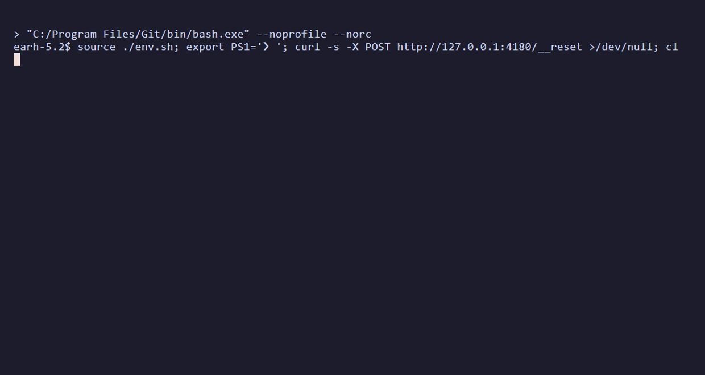

# Ten real apps, two tools, and what the database said

sitelooper is asked to do a job in a web app it has never seen, once, with a model in the loop.
It records what it did as a procedure. Then the app is reset and the same job is run twice more
with **no model at all**, and once more as a compiled `@playwright/test` file with no sitelooper
runtime either. Every run is scored by reading the app's own database or API after the fact. The
tool's own report of success is never counted.

The comparator is [agent-browser](https://github.com/vercel-labs/agent-browser) 0.34.0 driven by
an LLM, the usual way to automate a browser with an agent. It has no replay mode, so every run is
a first run. It was run with the same cheap model as sitelooper, and again with a model about 20×
more expensive per token.

Every figure below is from the batch of 29-30 September 2026 (main `1c4b8b14` to `0ad81e74`). Per-run
detail, run ids and results branches: [MATRIX-2026-09.md](MATRIX-2026-09.md).

*Three instructions recorded against the in-repo repair-desk app in 24s, 28s and 42s with the agent driving; the app reset; the same flow replayed in 16s at zero model calls, then the app's state endpoint queried. Source: [docs/demo](../docs/demo).*

## The matrix

Objectives verified against the app, cost at list price, wall clock.

| app | sitelooper, first run | sitelooper replay ×2 | compiled spec | agent-browser, GPT-6 Luna | agent-browser, GPT-6.1 Sol |
|---|---|---|---|---|---|
| repair-desk | 6/6 · $0.02 · 187s | **6/6, 6/6 · $0 · 52s** | 6/6 · 56s | 6/6 · $0.01 · 54s | 6/6 · $0.29 · 101s |
| Odoo | 6/6 · $0.07 · 589s | **6/6, 6/6 · $0 · 191-193s** | 6/6 · 141s | 3/6 · $0.02 · 138s | 6/6 · $0.37 · 195s |
| Grafana | 6/6 · $0.09 · 615s | **6/6, 6/6 · $0 · 144-145s** | pass · 151s | 5/6, then 6/6 · $0.04 · 194s | 4/6 · $0.33 · 191s |
| Kanboard | 6/6 · $0.05 · 357s | **6/6, 6/6 · $0 · 55-56s** | 4/4 + 2 report-only · 58s | 6/6, duplicate comment · $0.005 · 44s | 6/6 · $0.23 · 53s |
| OpenProject | 7/7 · $0.05 · 377s | **7/7, 7/7 · $0 · 93-132s** | 5/5 + 2 report-only · 69s | 7/7, duplicate comment · $0.02 · 117s | 7/7 · $0.38 · 107s |
| Gitea | 7/7 · $0.04 · 324s | **7/7, 7/7 · $0 · 75-76s** | 5/5 + 2 report-only · 61s | 6/7 · $0.09 · 262s | 7/7 · $0.25 · 91s |
| Vikunja | 7/7 · $0.04 · 270s | **7/7, 7/7 · $0 · 76s** | 5/5 + 2 report-only · 71s | 7/7, duplicate comment · $0.01 · 94s | 7/7 · $0.28 · 67s |
| EspoCRM | 7/7 · $0.06 · 454s | **7/7, 7/7 · $0 · 164-165s** | refused to compile | 1/7 · $0.02 · 120s | 7/7 · $0.23 · 183s |
| Snipe-IT | 7/7 · $0.04 · 298s | **7/7, 7/7 · $0 · 77-78s** | 5/5 + 2 report-only · 77s | 1/7 · $0.02 · 95s | 7/7 · $0.25 · 112s |
| Ghost | 7/7 · $0.02 · 142s | **7/7, 7/7 · $0 · 45-46s** | 5/5 + 2 report-only · 48s | 7/7 · $0.005 · 57s | 7/7 · $0.10 · 105s |

**sitelooper verified every objective in all 30 runs.** Both replays of every app ran as a flow
with zero model turns, so they cost nothing. Nine of the ten compiled specs pass; EspoCRM's
refused to compile (below).

**agent-browser on GPT-6 Luna was clean on 3 of its 11 runs** (repair-desk, Ghost, and the second
Grafana run). The rest:

- **Failed outright on three apps.** On Odoo it saved the second product with quantity 1, not 2,
  then never updated the first line or confirmed and cancelled the order. On EspoCRM it could not
  save the opportunity through the account and assignee autocompletes. On Snipe-IT the asset name
  never saved.
- **Missed an objective on two runs.** Gitea's assignee, and the first Grafana run's text panel.
- **Posted the comment twice on three apps** (Kanboard, OpenProject, Vikunja). A step ran twice
  with the first attempt landing. The verifier counts that as extra work, so it is not a clean run.
- **Reported unsaved work as done, twice.** Snipe-IT ("absi31-luna Bench Asset exists") and the
  first Grafana text panel. Only the app-side verifier caught them.

**agent-browser on GPT-6.1 Sol was clean on 9 of 10**, with no duplicate comments. The exception is
Grafana: the saved dashboard has no time range and no refresh, which the run reported as
"verified in JSON Model after reload". It read them on a page whose URL already carried
`?from=now-6h&refresh=1m`, so the editor showed those values whether they were saved or not.

## What it costs

| | first run | every later run |
|---|---|---|
| sitelooper, GPT-6 Luna + DeepSeek V4.1 Flash | $0.02-0.09 | **$0**, 46-193s |
| agent-browser, GPT-6 Luna | $0.005-0.09 | the same again, and 8 of 11 runs not clean |
| agent-browser, GPT-6.1 Sol | $0.10-0.38 | the same again |

On first contact sitelooper is the slowest arm on every app: it records verified locators, value
provenance and effect expectations while it works. After that its replays are about as fast as
an agent-browser run (faster than both agent-browser arms on five of ten apps) and free.
Matching sitelooper's correctness with agent-browser took a model about 20× the per-token price,
and it still missed one app.

## Models

- **sitelooper:** the orchestrator that writes instructions is GPT-6 Luna (`openai/gpt-6-luna`). The
  inner loop that drives the browser is DeepSeek V4.1 Flash (`deepseek/deepseek-v4.1-flash`, pinned
  to the DeepSeek backend). Escalation and recovery fall back to GPT-6 Luna. Recording runs use
  `--granularity objective`, which gives each call at most one numbered objective.
- **agent-browser:** one model drives it directly, GPT-6 Luna or GPT-6.1 Sol (`openai/gpt-6.1-sol`).
  The harness resolves the `{{env:APP_PASSWORD}}` reference in the commands it runs, so the password
  reaches the app but never the model or the transcript.
- All calls go through OpenRouter. Sol ran with 0-7 upstream rate-limit retries per run, which the
  harness waits out (`bench/or-errors.mjs`).

## The targets

Nine self-hosted third-party applications plus the repair-desk SPA that ships in this repo.
They were chosen by client technology, not by task, because every defect the benchmark has
found came from a DOM idiom not seen before. Full list, versions and what each one stresses:
[thirdparty/README.md](thirdparty/README.md).

| code | app | what it stresses |
|---|---|---|
| rd | repair-desk (in-repo) | SPA; list that refetches a beat after each mutation |
| od | Odoo 17 | dense server-rendered CRUD, hash routes, many2one autocompletes, a configurator modal |
| gr | Grafana 11 | React SPA, deep unnamed DOM, drawers and option panes |
| kb | Kanboard 1.2 | PHP and jQuery, full-page reloads, drag-and-drop |
| op | OpenProject 17 | Angular in Rails and Turbo, click-to-edit fields, ng-select |
| gt | Gitea 1.27 | Go templates and Vue islands, pickers that apply on menu close |
| vk | Vikunja 0.24 | Vue 3, contenteditable heading saving on blur, flatpickr, create-on-type labels |
| ec | EspoCRM 10 | Backbone hash routes, inline and full edit forms, select modals |
| si | Snipe-IT 8.7 | Laravel Blade, select2 AJAX dropdowns for every relation, a checkout form |
| gh | Ghost 6.64 | Ember admin, Lexical contenteditable body, multi-stage publish modal |

## The protocol

Each sitelooper sweep is k=3 on one cloud box per target. Run 1 records with the orchestrator on.
Runs 2 and 3 replay the learned flow against a reset app with no orchestrator. Then the compiled
Playwright script replays it once more. Each agent-browser run is one run on its own box against
a reset app. The same verifier scores every arm.

A target is **green** for sitelooper only when all three hold:

- every run verifies every objective, with no duplicate records and no stray mutations;
- every replayed step on runs 2 and 3 runs at tier A, meaning zero model turns;
- the compiled script compiles and passes, with at most report-only objectives unverifiable.

Nine of ten targets were green in this batch. EspoCRM met the first two conditions but not the
third: its 07-open step reads three values through an element named by a template
(`what={{v4}}`), which the replayer resolves at run time but a standalone spec cannot, so compile
refuses rather than emit reads that would come back blank. That gap is open.

Report-only objectives ask the run to state a value in its final report. A compiled spec writes no
report, so they are unverifiable for the compiled arm and are shown as "+ 2 report-only". The
Grafana compiled spec passed its own assertions; its verifier log was not published.

One row per sweep, with the cause of every miss, is in [SWEEPS.md](SWEEPS.md).

## What this benchmark does not show

- **Every comparator was run by us**, from its own documentation, with no tuning. A vendor would
  tune it better. The numbers show shapes, not ceilings.
- **One agent-browser run per app per model.** Grafana on Luna went 5/6 then 6/6 an hour apart; a
  single run is one sample of a distribution.
- **The closest competitors are missing.** Record-then-replay tools with model-on-drift, such as
  browser-use's workflow-use, Stagehand's action caching or the commercial self-healing suites,
  have no row yet.
- **Three clean runs is an execution gate, not a flakiness statistic.** A green sweep says the
  flow replayed model-free three times on one build against a reset app. It does not say how it
  survives a month of deploys.
- **First-contact recordings vary run to run.** They are model-driven, and recording cost and wall
  clock should be read as one sample each.

## Reproducing a row

```sh
docker compose -f bench/thirdparty/<name>/docker-compose.yml up -d
bash bench/thirdparty/<name>/seed.sh          # odoo, openproject, gitea, snipeit
export SITELOOPER_PROVIDER=openrouter SITELOOPER_MODEL=deepseek/deepseek-v4.1-flash \
  SITELOOPER_FALLBACK_MODEL=openai/gpt-6-luna \
  SITELOOPER_EXTRA_BODY='{"provider":{"only":["DeepSeek"]}}' SITELOOPER_SOURCING_HOLD=on
node bench/sweep.mjs --k 3 --arm sitelooper --target <name> --task bench/tasks/<name>-*.md \
  --provider openrouter --model openai/gpt-6-luna --maxUsd 3.00 --coarse --granularity objective \
  --verify-cmd "node bench/verify-<name>.mjs" --out bench/results

node bench/harness.mjs --arm agent-browser --target <name> --task bench/tasks/<name>-*.md \
  --provider openrouter --model openai/gpt-6.1-sol --maxUsd 3.00 --runid <id> --out bench/results --reset
node bench/verify-<name>.mjs <id>
```

The repair-desk row needs no container: `node bench/app/server.mjs`, then the same commands with
`--target repairdesk` and `--verify` in place of `--verify-cmd`. Verifiers are
`bench/verify-<name>.mjs`; each reads the app's mutation log, JSON-RPC or HTTP API and scores
every objective without trusting the run's report. The exact prompt each cloud box ran is in
`bench/sweep-prompts/<runid>.md`.
