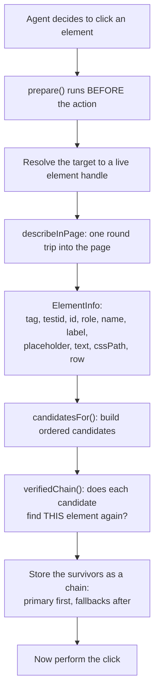
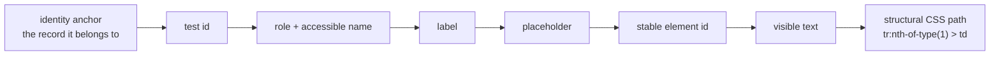
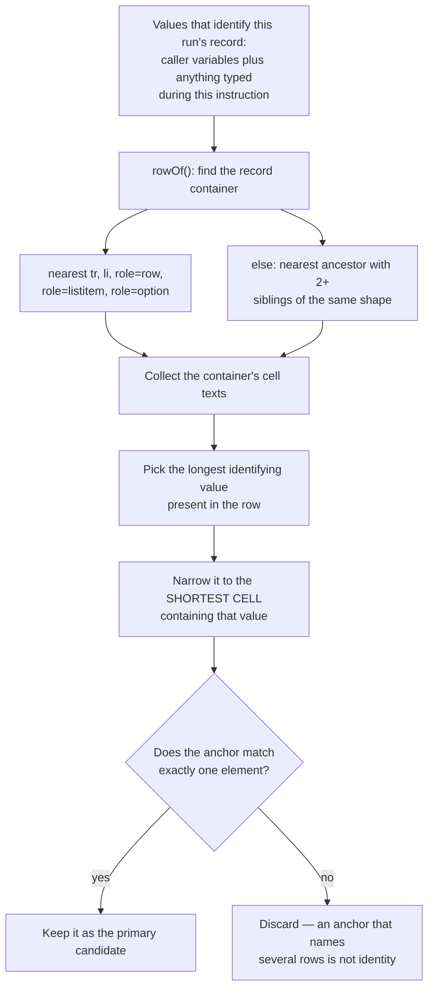
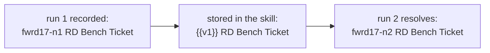
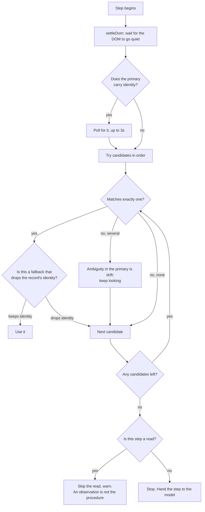
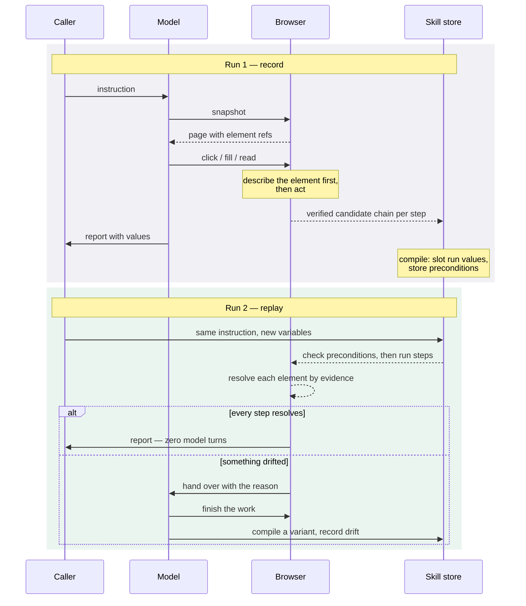

# Finding elements again

How sitelooper repeats a browser task without an LLM, using evidence it
collected the first time. Written for someone who has never seen this codebase.

## The problem

An agent drives a browser to do something real: sign in, create a ticket, add
two parts, edit one, mark it ready, delete the parts, archive it. A language
model makes every decision, so it costs money and takes minutes.

We want to do that task again tomorrow — same procedure, new data — with **no
model in the loop**. The obstacle is that the second run's page is not the
first run's page. Different record ids, different row order, different
neighbours, sometimes a redesigned control. A CSS selector captured on Monday
points at the wrong thing on Tuesday, and — this is the part that matters —
it usually points at *something*, so the failure is silent.

Concretely, from a real run:

| | run 1 (records) | run 2 (replays) |
| --- | --- | --- |
| cost | $0.0471 | **$0.0013** |
| wall clock | 417s | **52s** |
| model turns | 8 | **0** on 6 of 7 steps |

Everything below is how the second column is possible, and what stops it
being confidently wrong.

## Vocabulary

Five words, used precisely throughout.

- **Instruction** — one natural-language task given to the agent. "Create a
  ticket titled X."
- **Step** — one browser action inside an instruction: a click, a fill, a read.
- **Skill** — a compiled, parameterised recording of one instruction's steps.
  The reusable unit.
- **Flow** — an ordered list of instructions with their skills, exported from a
  whole session. What a replay runs.
- **Tier A / tier B** — tier A is a replay with zero model turns. Tier B is a
  replay the model asked for and supervised. Anything else is *recovery*: the
  model does the work itself and we learn from it.

## The core idea: record evidence, not a selector

When the agent acts on an element, we do not save "the selector". We save
several independent ways of finding it, ordered by how well they survive
change, and we verify each one against the element in front of us before
trusting it.



Two details carry a lot of weight.

**Capture happens before the action.** A click can navigate or unmount the very
element we want to describe. Describe first, act second.

**Every candidate is verified by identity, not by text.** We ask "does this
locator resolve back to *this exact node*?" — comparing element identity, not
comparing strings. Two buttons can both be labelled "Delete"; only one of them
is the one the agent used. If a candidate finds our element at position *n* in
a set of matches, we record that index rather than pretending it was unique.

## The kinds of evidence

Candidates are generated in a fixed preference order. The list is a ranking of
durability: things an app is unlikely to change sit at the top, things that
break the moment anything moves sit at the bottom.



For a cell in a ticket row, that yields something like:

```js
// primary — names the RECORD
page.locator('#ticket-rows tr', { hasText: '{{v1}} RD Bench Ticket' })
    .locator('td:nth-of-type(1)')

// fallbacks, in order
page.getByTestId('ticket-ref-t15')
page.locator('#ticket-rows > tr:nth-of-type(1) > td:nth-of-type(1)')
```

The last one is the interesting failure. On the recording run it is perfectly
correct: the new ticket really was row 1. On a later run, row 1 is whatever
sorted there — often a seed record left over from setup. It resolves
instantly, it looks like success, and every subsequent step then does correct
work on the wrong record. That single failure mode is the reason for
everything in the next two sections.

## Identity: naming the record, not its position

The top-ranked candidate is an **identity anchor**: find the row that contains
a value identifying this record, then find the element inside that row.

Building one:



Three things this gets right that are easy to get wrong:

**Rows are not always `<tr>`.** Plenty of apps render records as nested divs,
so if no semantic container exists we look for repetition: the nearest
ancestor with siblings of the same shape *is* the record container.

**The hint must be narrowed.** Every part created in one run might be named
`run-42 Part A`, `run-42 Part B`. Anchoring on `run-42` matches both rows. So
we narrow to the smallest cell that still contains the value — `run-42 Part A`
— which names one record and still carries the run's value.

**Uniqueness is proved, not assumed.** The check runs against the live page
that produced the anchor. An ambiguous anchor records perfectly cleanly (our
element is simply the first match) and then reads as drift on every future
run, so it is rejected at source.

## Slots: values that belong to one run

`{{v1}}` in the example above is a **slot**. Anything belonging to the
recording run — the run identifier, a title the agent typed, a generated id in
the URL — is replaced by a marker, and the skill records what it was as an
example only.



Slots are marked **known** when the caller vouched for the value — a declared
variable, an id the run itself minted, a value threaded from an earlier step's
output. Known slots are what make a locator *identity-bearing*, and that
distinction drives the guard in the next section.

A skill also stores preconditions: the URL pattern it runs on, a page
fingerprint, and `requireText` — parameterised text the page must be showing
before this procedure may run at all. The URL says you are on the right
*template*; `requireText` says you are on the right *record*.

## Replaying: how an element is found again



Three rules deserve explanation.

**Waiting for the record.** The agent never needed an explicit wait: a model
turn takes seconds, and it re-snapshots the page each turn, so anything the
app was about to paint had already appeared. A replay has no turns. Many apps
deliberately defer a list refresh after a create — close optimistically, then
revalidate — so the record is genuinely absent for a second. Polling the
identity anchor costs nothing when the row is already there and prevents "not
yet" being read as "not there".

**The identity guard.** If the primary named a record and a fallback does not,
the fallback is refused. Structurally it is the same element; semantically it
is a different record. Failing to a model is cheap; acting on the wrong record
is not.

**Reads fail soft, actions fail hard.** A read is an observation — if it cannot
be re-taken, the value is simply missing and later steps can recover. An
action is the procedure itself, so a missing target stops the step. And a read
that can now only be found *by position* publishes nothing at all: a missing
value is recoverable, a confidently wrong one corrupts everything downstream.

## The whole loop, both runs



## When it goes wrong

Drift is expected and recorded rather than hidden. Every fallthrough writes a
**drift ticket** naming the step, the locator that missed, the fallback used,
and whether the model had to recover — which is how the failures below were
diagnosed after the fact.

| what happened | what it looked like | the rule that now prevents it |
| --- | --- | --- |
| read pinned to row 1 | replay published a seed record's id, tier A, zero turns | identity anchors; positional reads publish nothing |
| anchor held the recording run's id | anchor matched nothing, silently fell to position | an anchor that cannot be parameterised is dropped |
| generated id baked into a skill's text | run 2 edited run 1's record | ids the session mints are slotted like any other run value |
| one step adopted another step's skill | two steps ran one read-only procedure, changed nothing, reported success | a step may not adopt a procedure another step owns |

The pattern across all four is the same: **a value or a procedure from the
recording run surviving into a replay.** They were found one at a time, in
different disguises, which is why the current work centralises the rule rather
than adding a fifth guard.

## Where to look in the code

| concern | file |
| --- | --- |
| describing an element, generating candidates | `src/daemon/recorder.ts` |
| turning a recording into a parameterised skill | `src/skills/compile.ts` |
| resolving candidates on a later run | `src/skills/replay.ts` |
| exporting and running a whole flow | `src/skills/flow.ts`, `src/daemon/server.ts` |
| drift tickets and post-session repair | `src/skills/repair.ts` |
